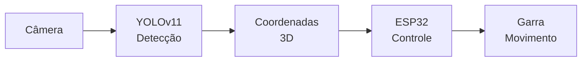
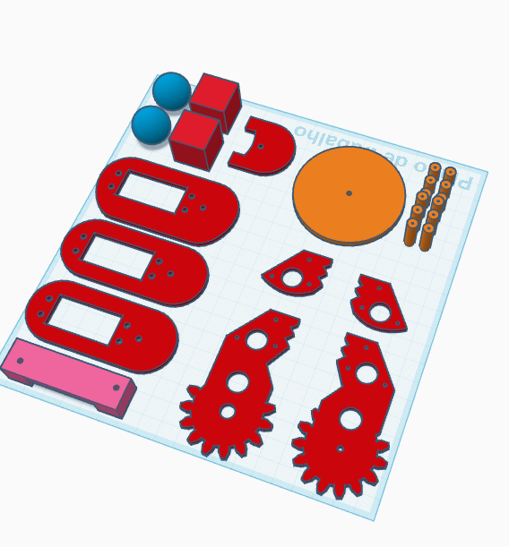
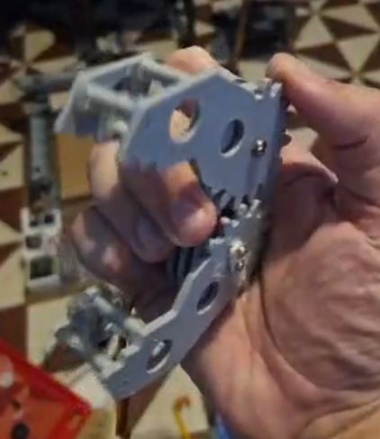
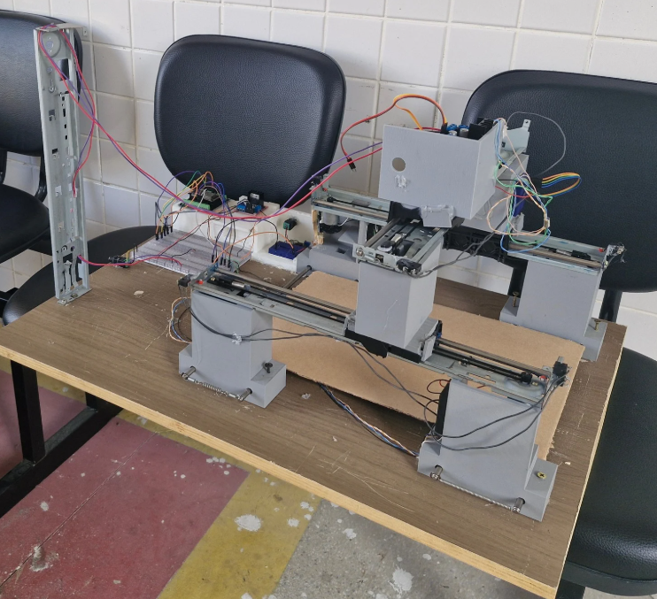
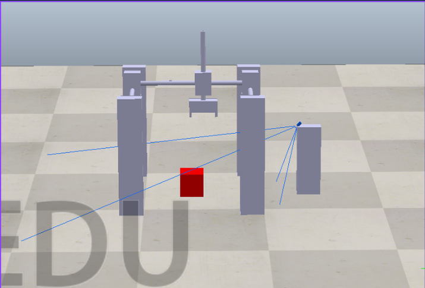

# Projeto FigurePicker

Sistema integrado de visão computacional e controle robótico para identificação, classificação e manipulação de objetos geométricos (cubos e esferas).

## Visão Geral

O FigurePicker é um projeto de robótica que combina:
- **Visão Computacional**: Detecção e classificação de objetos usando YOLO e classificadores tradicionais
- **Simulação**: Ambiente virtual completo em CoppeliaSim com garra cartesiana (PPP)
- **Hardware**: Sistema de controle físico com ESP32 usando comunicação ESP-NOW

### Fluxo do Sistema


## Estrutura do Projeto

```
Projeto_FigurePicker/
├── Garra/                 # Modelos 3D da garra
│   ├── tinker.obj        # Modelo 3D principal da garra
│   └── obj.mtl           # Arquivo de materiais
├── Hardware/              # Código para controle físico com ESP32
├── Simulation/            # Simulações em CoppeliaSim
│   ├── Entrega_11-11/    # Versão com câmera acoplada
│   └── Entrega_25-11/    # Versão com câmera externa
└── Vision_picker/         # Sistema de visão computacional
    ├── Classifier/        # Classificador tradicional (ML)
    ├── Coords/            # Extração de coordenadas
    ├── yolo_dataset/      # Scripts de preparação de dataset
    └── yolov11s/          # Modelo YOLO para detecção
```

## Componentes Principais

### 1. Garra (Modelos 3D)
Modelos 3D da garra utilizada no sistema:
- **tinker.obj**: Modelo 3D completo da garra cartesiana
- **obj.mtl**: Arquivo de materiais e texturas
- Formato OBJ para importação em simuladores (CoppeliaSim) e CAD




### 2. Hardware
Sistema de controle com dois ESP32 comunicando via ESP-NOW:
- ESP Principal: Controla movimento nos eixos X
- ESP Secundário: Controla movimentos nos eixos Y e Z
- Encoder para feedback de posição
- Interface serial para comandos



[Vídeo de demonstração do Hardware](Recursos/Hardware.mp4)

### 3. Simulation
Simulações em CoppeliaSim com evolução do sistema:
- **V1 (11/11)**: Câmera acoplada à garra, controle por pixel
- **V2 (25/11)**: Câmera externa em tripé, raycasting 3D completo



### 4. Vision Picker
Sistema completo de visão computacional:
- **YOLOv11s**: Detecção em tempo real de cubos e esferas
- **Classifier**: Classificador tradicional baseado em características
- **Dataset Tools**: Scripts para preparação e augmentation de dados


## Instalação

### Requisitos
- Python 3.8+
- Arduino IDE (para ESP32)
- CoppeliaSim (para simulações)

### Python Dependencies
```bash
pip install -r Vision_picker/requirements.txt
```

## Funcionalidades

- ✅ Detecção de objetos geométricos (cubos e esferas)
- ✅ Classificação de formas usando ML
- ✅ Cálculo de coordenadas 3D
- ✅ Simulação completa com raycasting
- ✅ Controle físico com feedback de encoder
- ✅ Comunicação wireless entre ESP32
- ✅ Dataset augmentation automático

## Uso

### Treinar Modelo YOLO
```bash
cd Vision_picker/yolov11s
python train.py
```

### Executar Detecção
```bash
cd Vision_picker/yolov11s
python inference_yolov11.py
```

### Classificar Imagem
```bash
cd Vision_picker/Classifier
python img_classifier.py
```

## Dataset

O projeto utiliza dataset customizado com:
- Cubos e esferas em diversas condições de iluminação
- Augmentation automático para balanceamento
- Divisão: 70% train / 20% val / 10% test

## Hardware Setup

1. Grave o código `MacFinder.ino` para identificar os endereços MAC
2. Atualize os endereços no código principal
3. Configure ESP Principal e Secundário
4. Conecte encoders e motores conforme pinout

## Documentação Detalhada

Cada pasta contém seu próprio README com detalhes específicos:
- [Hardware/README.md](Hardware/README.md) - Sistema físico, pinout, protocolo ESP-NOW
- [Simulation/Entrega_11-11/Readme.md](Simulation/Entrega_11-11/Readme.md) - Simulação V1 (câmera acoplada)
- [Simulation/Entrega_25-11/README.md](Simulation/Entrega_25-11/README.md) - Simulação V2 (raycasting 3D)
- [Vision_picker/README.md](Vision_picker/README.md) - Sistema de visão completo
- [Vision_picker/yolov11s/README.md](Vision_picker/yolov11s/README.md) - Treinamento e inferência YOLO
- [Vision_picker/Classifier/README.md](Vision_picker/Classifier/README.md) - Classificador tradicional ML

## Contribuidores

Projeto desenvolvido como parte do curso de Robótica.

## Histórico de Versões

- **25/11/2025**: Migração para câmera externa com raycasting 3D
- **11/11/2025**: Versão inicial com câmera acoplada
- **Dezembro/2025**: Integração completa visão + hardware
