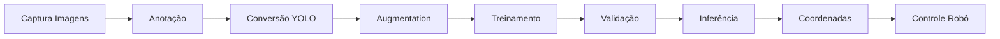

# Vision Picker - Sistema de Visão Computacional

Sistema completo de visão computacional para detecção, classificação e localização de objetos geométricos (cubos e esferas).

## Visão Geral

O módulo Vision Picker implementa duas abordagens complementares para processamento de imagens:
1. **YOLOv11s**: Detecção em tempo real de objetos
2. **Classificador Tradicional**: Classificação baseada em características extraídas

## Estrutura

```
Vision_picker/
├── requirements.txt              # Dependências Python
├── Classifier/                   # Classificador tradicional ML
│   ├── img_classifier.py        # Script de classificação
│   ├── train_classifier.py      # Treinamento do modelo
│   └── models/
│       └── model_params.json    # Parâmetros do modelo
├── Coords/                       # Extração de coordenadas
│   └── get_pos.py               # Detecção e posicionamento
├── yolo_dataset/                 # Preparação de dataset
│   ├── augmentation_com_labels.py
│   ├── converter_heic_para_jpg.py
│   ├── converter_labelme_to_yolo.py
│   ├── preparar_anotacao_final.py
│   ├── remover_heic.py
│   └── split_train_val.py
└── yolov11s/                     # Modelo YOLO
    ├── train.py                 # Treinamento YOLOv11s
    ├── inference_yolov11.py     # Inferência e detecção
    └── runs/                    # Resultados de treinamento
        └── detect/
            └── cubes_spheres_yolo11s/
```

## Instalação

### Requisitos
- Python 3.8 ou superior
- CUDA (opcional, para GPU)
- Webcam ou câmera USB (para detecção em tempo real)

### Instalação de Dependências

```bash
cd Vision_picker
pip install -r requirements.txt
```

### Dependências Principais
- `ultralytics>=8.0.0` - Framework YOLO
- `opencv-python` - Processamento de imagens
- `torch` + `torchvision` - Deep Learning
- `roboflow` - Download de datasets
- `scikit-learn` - Machine Learning tradicional
- `matplotlib` + `seaborn` - Visualização

## Componentes

### 1. YOLOv11s - Detecção em Tempo Real

Modelo de detecção de objetos baseado em YOLOv11 small, treinado especificamente para cubos e esferas.

#### Treinamento
```bash
cd yolov11s
python train.py
```

**Características do Treinamento:**
- Dataset do Roboflow (workspace: w0, project: 3d-geom-shape-detector)
- Filtragem automática: mantém apenas cubos e esferas
- Divisão: 70% train / 20% val / 10% test
- Augmentation para balanceamento de classes
- 150 épocas, batch size 16, imagem 640x640

#### Inferência
```bash
cd yolov11s
python inference_yolov11.py
```

**Funcionalidades:**
- Detecção em tempo real via webcam
- Suporte a imagens e vídeos
- Bounding boxes com confidence score
- Contagem de objetos por classe
- Salvamento de resultados

### 2. Classificador Tradicional

Classificador baseado em Machine Learning tradicional usando características extraídas das imagens.

#### Treinamento
```bash
cd Classifier
python train_classifier.py
```

**Pipeline:**
1. Carregamento de dataset
2. Extração de características (cor, forma, textura)
3. Treinamento de classificador (SVM, Random Forest, etc.)
4. Validação e salvamento do modelo

#### Classificação
```bash
cd Classifier
python img_classifier.py
```

**Processo:**
1. Seleção de imagem via dialog
2. Pré-processamento (resize para 64x64)
3. Extração de características
4. Predição da classe
5. Exibição do resultado

### 3. Sistema de Coordenadas

Extração de posição e coordenadas de objetos detectados.

```bash
cd Coords
python get_pos.py
```

**Funcionalidades:**
- Detecção de contornos
- Cálculo de centróides
- Classificação de formas
- Estimativa de distâncias
- Visualização com matplotlib

### 4. Dataset Tools

Scripts para preparação e augmentation de datasets.

#### Conversão de Formatos
```bash
cd yolo_dataset
python converter_heic_para_jpg.py    # HEIC → JPG
python converter_labelme_to_yolo.py  # LabelMe → YOLO
```

#### Preparação de Dataset
```bash
python preparar_anotacao_final.py    # Preparação final
python split_train_val.py            # Divisão train/val/test
```

#### Data Augmentation
```bash
python augmentation_com_labels.py    # Augmentation com labels
```

**Transformações Aplicadas:**
- Horizontal/Vertical Flip
- Rotação (±15°)
- Random Scale (±20%)
- Brightness/Contrast adjustment
- Hue/Saturation/Value shifts
- Gaussian Noise + Blur
- Motion Blur
- Coarse Dropout

## Uso Típico

### Pipeline Completo

1. **Preparar Dataset**
   ```bash
   cd yolo_dataset
   python converter_heic_para_jpg.py
   python converter_labelme_to_yolo.py
   python split_train_val.py
   python augmentation_com_labels.py
   ```

2. **Treinar YOLO**
   ```bash
   cd ../yolov11s
   python train.py
   ```

3. **Executar Detecção**
   ```bash
   python inference_yolov11.py
   ```

4. **Obter Coordenadas**
   ```bash
   cd ../Coords
   python get_pos.py
   ```

## Resultados e Métricas

### YOLOv11s
- **mAP@0.5**: ~0.95+ (após 150 épocas)
- **Precision**: ~0.93+
- **Recall**: ~0.92+
- **FPS**: 30-60 (GPU) / 5-10 (CPU)

### Classificador Tradicional
- **Accuracy**: ~0.85-0.90
- **Tamanho**: 64x64 pixels
- **Features**: Cor RGB flattened (12288 features)

## 🔧 Configuração

### Dataset YOLO (train.py)
```python
API_KEY = "sua_chave_roboflow"
WORKSPACE = "w0"
PROJECT = "3d-geom-shape-detector"
VERSION = 1

TRAIN_PCT = 70
VAL_PCT = 20
TEST_PCT = 10

EPOCHS = 150
BATCH_SIZE = 16
IMG_SIZE = 640
```

### Classificador (img_classifier.py)
```python
IMG_SIZE = (64, 64)
LABEL_MAP = {0: "cubo", 1: "esfera"}
MODEL_PATH = '../Classifier/models/melhor_modelo.pkl'
```

## Visualização

### Detecção YOLO
- Bounding boxes coloridas por classe
- Confidence scores exibidos
- Contagem de objetos em tempo real
- Salvamento automático de frames

### Classificador
- Imagem com label predito
- Texto overlay com classe
- Display em janela OpenCV

## Troubleshooting

### CUDA não disponível
```python
# Força CPU
DEVICE = 'cpu'
```

### Erro de memória no treinamento
```python
# Reduz batch size
BATCH_SIZE = 8
```

### Dataset vazio após filtragem
```python
# Verifica labels no dataset
# Certifica-se que existem anotações para cubos/esferas
```

### Modelo não carrega
```bash
# Verifica caminho do modelo
ls Classifier/models/
ls yolov11s/runs/detect/
```

## Estrutura do Dataset

### Formato YOLO
```
dataset/
├── images/
│   ├── train/
│   ├── val/
│   └── test/
└── labels/
    ├── train/
    ├── val/
    └── test/
```

### Formato de Label (.txt)
```
<class_id> <x_center> <y_center> <width> <height>
```
Valores normalizados entre 0 e 1.

## Algoritmos Implementados

### Detecção de Objetos
- **YOLOv11s**: Arquitetura CSPDarknet + PANet + YOLOv11 head
- **Anchor-free**: Sem anchor boxes pré-definidos
- **Multi-scale**: Detecção em múltiplas escalas

### Classificação
- **Feature Extraction**: RGB flattening
- **Classifiers**: SVM, Random Forest, KNN
- **Preprocessing**: Resize + Normalization

### Segmentação
- **Color-based**: HSV thresholding
- **Contour detection**: findContours OpenCV
- **Shape analysis**: Aproximação poligonal

## Casos de Uso

1. **Robótica**: Pick-and-place de objetos
2. **Controle de Qualidade**: Inspeção de peças
3. **Contagem**: Inventário automático
4. **Sorting**: Separação por forma/cor

## Notas Importantes

- ⚠️ Modelo YOLO requer GPU para treinamento eficiente
- ⚠️ Dataset augmentation aumenta significativamente o tempo de preparação
- ⚠️ Classificador tradicional é mais rápido mas menos preciso que YOLO
- ⚠️ Webcam deve ter boa iluminação para melhores resultados

## Workflow Recomendado



## Exemplos de Saída

### Detecção YOLO
```
Frame 1:
  - Cubo: 2 objetos detectados
  - Esfera: 1 objeto detectado
  - Confidence média: 0.94
```

### Classificação
```
Imagem: objeto_01.jpg
Classe predita: Cubo
Confidence: 0.89
```

### Coordenadas
```
Objeto 1:
  - Tipo: Cubo
  - Centro: (320, 240)
  - Área: 4500 px²
  - Distância: 45.2 cm
```
