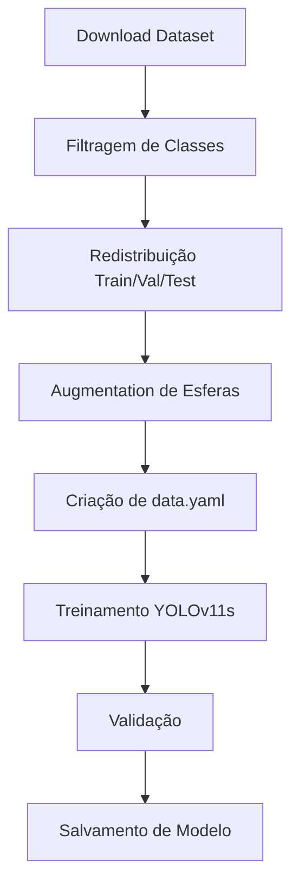

# YOLOv11s - Detecção de Objetos em Tempo Real

Sistema de detecção de objetos baseado em YOLOv11 small, especializado na identificação de cubos e esferas.

## Visão Geral

Este módulo implementa um detector de objetos usando a arquitetura YOLOv11s (small), otimizado para identificar formas geométricas (cubos e esferas) em tempo real. O sistema integra download automático de dataset do Roboflow, filtragem de classes, data augmentation e treinamento completo.

## Estrutura

```
yolov11s/
├── train.py                  # Script completo de treinamento
├── inference_yolov11.py      # Script de inferência/detecção
└── runs/                     # Resultados de treinamento
    └── detect/
        └── cubes_spheres_yolo11s/
            ├── weights/
            │   ├── best.pt   # Melhor modelo
            │   └── last.pt   # Último checkpoint
            ├── args.yaml     # Argumentos de treinamento
            ├── results.png   # Gráficos de métricas
            └── confusion_matrix.png
```

## Instalação

### Dependências
```bash
pip install ultralytics>=8.0.0 roboflow opencv-python pyyaml matplotlib seaborn torch torchvision
```

### Verificar GPU
```python
import torch
print(f"CUDA disponível: {torch.cuda.is_available()}")
print(f"Device: {torch.cuda.get_device_name(0) if torch.cuda.is_available() else 'CPU'}")
```

## Funcionamento

### Pipeline de Treinamento (train.py)



#### 1. Download do Dataset (Roboflow)
```python
API_KEY = "RGZ4JUpt6YMS1ZreoZAT"
WORKSPACE = "w0"
PROJECT = "3d-geom-shape-detector"
VERSION = 1

rf = Roboflow(api_key=API_KEY)
project = rf.workspace(WORKSPACE).project(PROJECT)
dataset = project.version(VERSION).download("yolov8")
```

#### 2. Filtragem de Classes
- Mantém apenas classes: **cubo** e **esfera**
- Remove outras formas geométricas (cilindros, pirâmides, etc.)
- Exclui imagens e labels de classes não desejadas

#### 3. Redistribuição do Dataset
```python
TRAIN_PCT = 70   # 70% para treinamento
VAL_PCT = 20     # 20% para validação
TEST_PCT = 10    # 10% para teste
```

#### 4. Data Augmentation (apenas esferas)
Aplicado para equilibrar classes:
```python
augmentations = [
    HorizontalFlip(p=0.5),
    VerticalFlip(p=0.3),
    Rotate(limit=25, p=0.5),
    RandomBrightnessContrast(p=0.5),
    GaussNoise(p=0.3),
    Blur(p=0.3)
]
```

#### 5. Treinamento
```python
model = YOLO('yolo11s.pt')
results = model.train(
    data='data.yaml',
    epochs=150,
    batch=16,
    imgsz=640,
    device='cuda' if torch.cuda.is_available() else 'cpu',
    patience=20,
    save=True,
    plots=True
)
```

## Uso

### Treinar Modelo

```bash
python train.py
```

**Processo automático:**
1. ✅ Download do dataset do Roboflow
2. ✅ Filtragem de classes
3. ✅ Redistribuição 70/20/10
4. ✅ Augmentation de esferas
5. ✅ Criação de data.yaml
6. ✅ Treinamento por 150 épocas
7. ✅ Salvamento de best.pt e last.pt

**Tempo estimado:**
- GPU (RTX 3060): ~2-3 horas
- CPU: ~10-15 horas

### Inferência - Webcam em Tempo Real

```bash
python inference_yolov11.py
```

**Controles:**
- **Espaço**: Pausar/Continuar
- **'s'**: Salvar frame atual
- **'q'**: Sair

### Inferência - Imagem

```python
from ultralytics import YOLO

model = YOLO('runs/detect/cubes_spheres_yolo11s/weights/best.pt')
results = model.predict('image.jpg', conf=0.5)
results[0].show()
```

### Inferência - Vídeo

```python
model = YOLO('runs/detect/cubes_spheres_yolo11s/weights/best.pt')
results = model.predict('video.mp4', save=True, conf=0.5)
```

## Configuração

### Parâmetros de Treinamento (train.py)

```python
# Dataset Roboflow
API_KEY = "RGZ4JUpt6YMS1ZreoZAT"
WORKSPACE = "w0"
PROJECT = "3d-geom-shape-detector"
VERSION = 1

# Divisão do dataset
TRAIN_PCT = 70
VAL_PCT = 20
TEST_PCT = 10

# Diretórios
OUTPUT_DIR = "dataset_balanced"

# Modelo
MODEL = "yolo11s"  # ou "yolo11n", "yolo11m", "yolo11l", "yolo11x"

# Hiperparâmetros
EPOCHS = 150
BATCH_SIZE = 16
IMG_SIZE = 640

# Device
DEVICE = 'cuda' if torch.cuda.is_available() else 'cpu'

# Classes mantidas
KEEP_CLASSES = ['cubo', 'esfera']
```

### Parâmetros de Inferência (inference_yolov11.py)

```python
MODEL_PATH = 'runs/detect/cubes_spheres_yolo11s/weights/best.pt'
CONFIDENCE_THRESHOLD = 0.5
IOU_THRESHOLD = 0.45
DEVICE = 'cuda' if torch.cuda.is_available() else 'cpu'
```

## Métricas e Resultados

### Métricas Calculadas

Durante o treinamento, o YOLO calcula:

- **Precision**: Proporção de detecções corretas
- **Recall**: Proporção de objetos detectados
- **mAP@0.5**: Mean Average Precision com IoU threshold de 0.5
- **mAP@0.5:0.95**: mAP calculado de IoU 0.5 a 0.95

### Resultados Esperados

```
Época 150/150:
├── Box Loss: 0.8 → 0.3
├── Class Loss: 1.2 → 0.4
├── DFL Loss: 1.0 → 0.6
├── Precision: 0.93
├── Recall: 0.92
└── mAP@0.5: 0.95
```

### Visualizações Geradas

O treinamento gera automaticamente:

1. **results.png**: Curvas de loss e métricas
2. **confusion_matrix.png**: Matriz de confusão
3. **PR_curve.png**: Curva Precision-Recall
4. **F1_curve.png**: Curva F1-Score
5. **labels.jpg**: Distribuição de labels
6. **val_batch_predictions.jpg**: Exemplos de predições

## Formato de Saída

### Detecção em Tempo Real

```
Frame: 1234
FPS: 45.2

Detecções:
  - Cubo: 2 objetos
    [1] Conf: 0.94 | Box: (120, 150, 320, 380)
    [2] Conf: 0.89 | Box: (450, 200, 580, 410)
  
  - Esfera: 1 objeto
    [1] Conf: 0.96 | Box: (300, 100, 450, 280)

Total: 3 objetos
```

### Bounding Box

Cada detecção contém:
```python
result.boxes.xyxy     # Coordenadas [x1, y1, x2, y2]
result.boxes.conf     # Confidence score [0-1]
result.boxes.cls      # Classe (0=cubo, 1=esfera)
```

## Arquitetura YOLOv11s

### Componentes Principais

1. **Backbone**: CSPDarknet53
   - Feature extraction em múltiplas escalas
   - Cross-Stage Partial connections

2. **Neck**: PANet (Path Aggregation Network)
   - Fusão de features multi-escala
   - Bottom-up + Top-down paths

3. **Head**: YOLO Detection Head
   - Anchor-free detection
   - Predição de bounding boxes + classes

### Especificações

| Parâmetro | Valor |
|-----------|-------|
| **Tamanho** | ~20-25 MB |
| **Parâmetros** | ~11M |
| **FPS (GPU)** | 30-60 |
| **FPS (CPU)** | 5-10 |
| **Input Size** | 640x640 |
| **Classes** | 2 (cubo, esfera) |

## Casos de Uso

### 1. Detecção em Tempo Real
```python
import cv2
from ultralytics import YOLO

model = YOLO('best.pt')
cap = cv2.VideoCapture(0)

while True:
    ret, frame = cap.read()
    if not ret:
        break
    
    results = model.predict(frame, conf=0.5)
    annotated = results[0].plot()
    
    cv2.imshow('Detection', annotated)
    if cv2.waitKey(1) & 0xFF == ord('q'):
        break

cap.release()
cv2.destroyAllWindows()
```

### 2. Batch Processing
```python
from pathlib import Path

model = YOLO('best.pt')
image_dir = Path('images/')

for img_path in image_dir.glob('*.jpg'):
    results = model.predict(str(img_path), save=True)
    print(f"{img_path.name}: {len(results[0].boxes)} objetos")
```

### 3. Extração de Coordenadas
```python
results = model.predict('image.jpg')

for box in results[0].boxes:
    x1, y1, x2, y2 = box.xyxy[0]
    conf = box.conf[0]
    cls = int(box.cls[0])
    
    center_x = (x1 + x2) / 2
    center_y = (y1 + y2) / 2
    
    print(f"Classe {cls}: Centro ({center_x:.1f}, {center_y:.1f}) | Conf: {conf:.2f}")
```

## Troubleshooting

### Erro: CUDA out of memory
```python
# Reduz batch size
BATCH_SIZE = 8  # ou 4

# Ou força CPU
DEVICE = 'cpu'
```

### Dataset vazio após filtragem
```python
# Verifica classes disponíveis no dataset
import yaml
with open('data.yaml', 'r') as f:
    data = yaml.safe_load(f)
print(f"Classes: {data['names']}")
```

### Modelo não converge
- Aumentar epochs (200-300)
- Ajustar learning rate
- Verificar qualidade das anotações
- Aumentar dataset com augmentation

### FPS baixo
```python
# Usar modelo menor
model = YOLO('yolo11n.pt')  # nano version

# Reduzir tamanho da imagem
results = model.predict(frame, imgsz=320)

# Half precision (GPU)
model = YOLO('best.pt', half=True)
```

## Data Augmentation

### Transformações Aplicadas (apenas esferas)

```python
import albumentations as A

transform = A.Compose([
    A.HorizontalFlip(p=0.5),
    A.VerticalFlip(p=0.3),
    A.Rotate(limit=25, p=0.5),
    A.RandomBrightnessContrast(
        brightness_limit=0.2, 
        contrast_limit=0.2, 
        p=0.5
    ),
    A.GaussNoise(var_limit=(10.0, 50.0), p=0.3),
    A.GaussianBlur(blur_limit=(3, 7), p=0.3),
    A.HueSaturationValue(
        hue_shift_limit=20,
        sat_shift_limit=30,
        val_shift_limit=20,
        p=0.5
    )
], bbox_params=A.BboxParams(
    format='yolo',
    label_fields=['class_labels']
))
```

## Fine-tuning

### Retreinar com Novos Dados

```python
# Carrega modelo pré-treinado
model = YOLO('runs/detect/cubes_spheres_yolo11s/weights/best.pt')

# Continua treinamento
model.train(
    data='new_data.yaml',
    epochs=50,
    batch=16,
    resume=True  # Continua do checkpoint
)
```

### Transfer Learning

```python
# Usa modelo base COCO
model = YOLO('yolo11s.pt')

# Fine-tune para suas classes
model.train(
    data='data.yaml',
    epochs=100,
    freeze=10  # Congela primeiras 10 camadas
)
```

## Recursos Adicionais

### Otimizações Avançadas

1. **TensorRT** (NVIDIA GPU)
```python
model.export(format='engine')  # Converte para TensorRT
```

2. **ONNX** (Cross-platform)
```python
model.export(format='onnx')
```

3. **CoreML** (iOS/macOS)
```python
model.export(format='coreml')
```

### Hyperparameter Tuning

```python
model.tune(
    data='data.yaml',
    epochs=30,
    iterations=300,
    optimizer='AdamW'
)
```

## Formato data.yaml

```yaml
path: dataset_balanced
train: images/train
val: images/val
test: images/test

nc: 2
names:
  0: cubo
  1: esfera
```

## Comparação de Modelos YOLO

| Modelo | Tamanho | Parâmetros | FPS (GPU) | mAP |
|--------|---------|------------|-----------|-----|
| YOLOv11n | 6 MB | 3M | 80+ | 0.93 |
| **YOLOv11s** | **22 MB** | **11M** | **60** | **0.95** |
| YOLOv11m | 50 MB | 25M | 40 | 0.96 |
| YOLOv11l | 100 MB | 50M | 25 | 0.97 |

## Integração com Sistema

### Integração com Coords
```python
# get_pos.py pode usar este modelo
from ultralytics import YOLO

model = YOLO('yolov11s/runs/detect/cubes_spheres_yolo11s/weights/best.pt')
results = model.predict(frame)

for box in results[0].boxes:
    x1, y1, x2, y2 = box.xyxy[0]
    center = ((x1 + x2) / 2, (y1 + y2) / 2)
    # Enviar coordenadas para controle robótico
```

### Integração com Hardware
```python
# Enviar comandos para ESP32 baseado em detecções
if len(results[0].boxes) > 0:
    # Pegar primeiro objeto
    box = results[0].boxes[0]
    center_x, center_y = calcular_centro(box)
    
    # Enviar coordenadas via serial
    send_to_esp32(center_x, center_y)
```

## Performance Tips

1. **Use GPU**: ~10x mais rápido que CPU
2. **Half Precision**: 2x mais rápido em GPUs compatíveis
3. **Batch Processing**: Mais eficiente que frame-by-frame
4. **Resize Input**: Imagens menores = mais FPS
5. **Model Quantization**: Menor tamanho, mantém precisão
